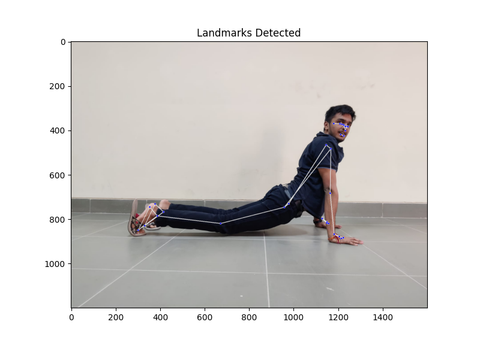

# YogaPal 🧘‍♀️


---

***How to use:*** <br>
`model_training.py`
```
usage: model_training.py [-h] [--data_path DATA_PATH] [--epochs EPOCHS] [--batch_size BATCH_SIZE] [--lr LR]
                         [--save_path SAVE_PATH] [--gpu GPU]

Train Model for Yoga Pose Classification
options:
  -h, --help               show this help message and exit
  --data_path DATA_PATH    path to model
  --epochs EPOCHS          number of epochs
  --batch_size BATCH_SIZE  batch size for training and testing
  --lr LR                  learning rate for training
  --save_path SAVE_PATH    path to save model
  --gpu GPU                use gpu for training
```

`predict.py`
```
usage: predict.py [-h] [--model MODEL] [--image IMAGE] [--check_landmarks] [--print_prob]

Predict Yoga Pose
options:
  -h, --help         show this help message and exit
  --model MODEL      path to model
  --image IMAGE      path to image
  --check_landmarks  display landmark detected image
  --print_prob       print probability of each class
```

`feature_analysis.ipynb` <br>
 tldr: feature engineering; 

`get_data_poses.ipynb` <br>
 extract the landmark data using mediapipe from all classes under *./data/* and store *.csv* files for each class under *./pose_data/*

`top_100_features_names.json` ***(auto generated from feature_analysis.ipynb)*** <br>
 file records the landmarks needed to construct the best 100 features to be passed to PCA

`scaler.npy` ***(auto generated from feature_analysis.ipynb)*** <br>
scaler is used to standardize the data according to the mean and variance of the training data

`pca_compponents.npy` ***(auto generated from feature_analysis.ipynb)*** <br>
pca_components is used to transform the data into lower dimension to cover 95% variance according to feature analysis

`mapping.json` ***(auto generated from get_data_poses.ipynb)***
gives the mapping of the pose number to the pose name

`pca_features.csv` ***(auto generated from feature_analysis.ipynb)***
used to train the model; passed as arg to model_training.py