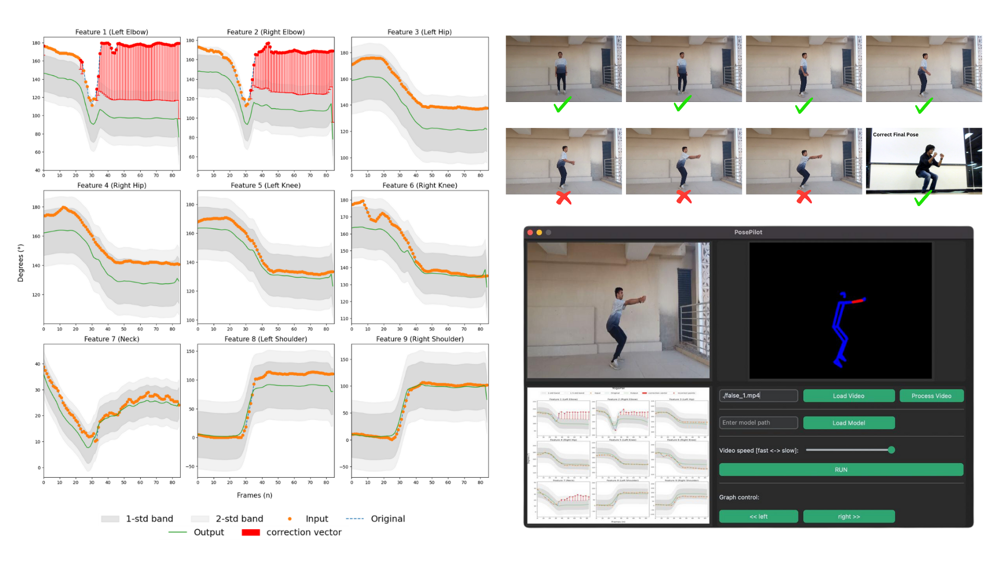

# PosePilot 🧘
#### A Novel Posture Correction System Leveraging BiLSTM and Multihead Attention 

## Intro
Providing automated pose correction feedback for
at-home fitness solutions remains a big challenge. This work
introduces PosePilot, a novel integrated solution evaluated on
Yoga, an ancient Indian practice rooted in holistic well-being.
PosePilot has been trained on real-world videos sourced from
Yoga practitioners, encompassing the performance of six asanas
captured from four different viewpoints. Vanilla LSTM was
employed for sequential modeling, enabling PosePilot to capture
temporal dependencies for pose recognition. Furthermore, we utilized BiLSTM with Multihead Attention to enhance the model’s
capacity to examine both forward and backward temporal contexts, enabling selective focus on pertinent limb angles for error
detection. Finally, we also provide correctives for each pose for
every temporal stage of the pose.

## PosePilot in Wild

Incorrectly performed *Utkatasana* pose [elbows should be bent close to a 90° angle]

#### Correction Graph

#### GUI Output

### Dataset

Our inhouse was created with videos from four angles, featuring 14 participants (ages 17-25) performing six poses. Frame-by-frame keypoint extraction using Mediapipe identified 33 keypoints, with 17 used to compute 680 angles for pose analysis. The dataset contains 336 videos, filmed indoors with controlled lighting.

